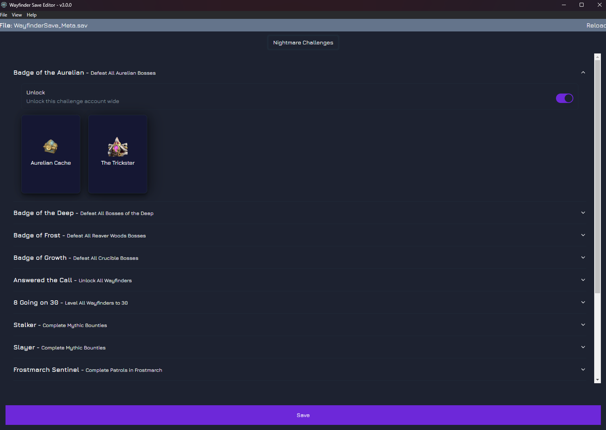
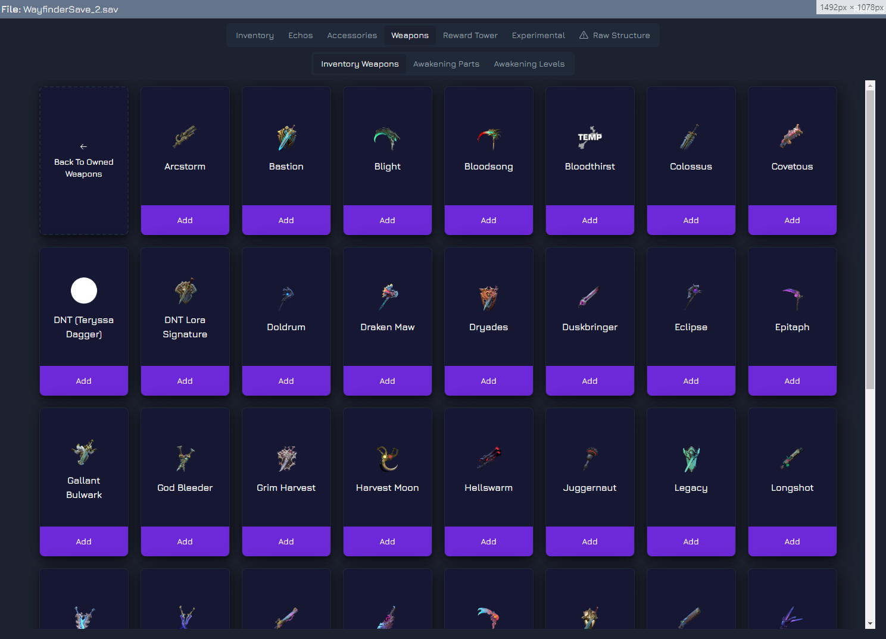

# Wayfinder Save Editor

### MAKE SURE YOU BACKUP YOUR SAVE BEFORE USING IT!!!! I'm not responsible if this breaks your save

## Save files location

Save files are located at **%localappdata%/Wayfinder/Saved/SaveGames**

## How to use it

### BEFORE YOU EDIT YOUR SAVE

There's a known bug with certain languages with special characters where the save isn't encoded correctly and breaks. To avoid this, change your game language to **English** first and then edit your save. You are free to revert to the original language after you have done the edits.

---

Download and unzip the latest release at https://github.com/3nvy/wayfinder-save-editor/releases/latest

Then run the **Wayfinder - Save Editor.exe** file to start the save editor

Once booted, press the button to load the save file from the location above.

The save file you want to edit is usually the last modified one, but if you are in doubt, you can load the "\_Meta" file, and it will tell you which save file you need to load

## Steam Cloud Saves

Steam cloud saves are known for causing conflicts with the modified saves. If you are having issues editing your save, try disabling it.

## Manage Wayfinder Rank & Wayfinders level, afinity, abilities and talent tree

## Manage Inventory Items: Currencies, Resources, Imbuements, Mounts (w/ Saddles), Housing Items & Awakening Stones

## Add Items from Founder's Catalogue

Mind this are only the items belonging to the founders pack, it doesn't include things like automatic attribution of Battle Tower rewards. That will come in a searate panel (see future updates)

## Add/Edit Echos

This panel allows to add new echos to your inventory, and allows to edit the level, rarity and equip cost

## Add/Edit Accessories

This panel allows to add new accessories to your inventory, and allows to edit the level and echo slots

## Weapon Manager

### Allows to add/edit any weapon, add weapon crafting parts and edit weapon awakening level

## Experimental Features

### This will have a set of experimental features. Currently it has:

- Replace current default for a bigger one

- Fix Kyros when added via Founders tab on previous versions

## Free text edit of the entire save structure (Advanced)

### General credits

to ch1pset for providing the groundwork for ue save decoding https://github.com/ch1pset/UESaveTool

## If you like my work, consider buying me a coffe

