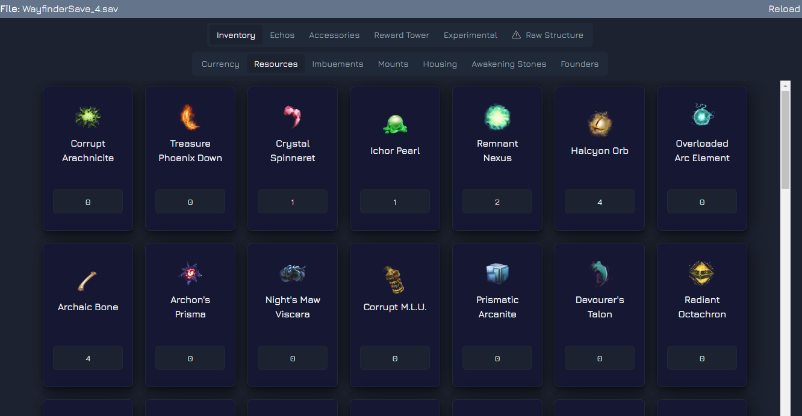

# Wayfinder Save Editor

### This tool is experimental, MAKE SURE YOU BACKUP YOUR SAVE BEFORE USING IT!!!! I'm not responsible if this breaks your save

You can download the latest version here

This is still experimental and very basic, but should provide the following:

## Manage Inventory Items: Currencies, Resources, Imbuements, Mounts (w/ Saddles), Housing Items & Awakening Stones

## Add Items from Founder's Catalogue

Mind this are only the items belonging to the founders pack, it doesn't include things like automatic attribution of Battle Tower rewards. That will come in a searate panel (see future updates)

## Add/Edit Echos

This panel allows to add new echos to your inventory, and allows to edit the level, rarity and equip cost

## Add/Edit Accessories

This panel allows to add new accessories to your inventory, and allows to edit the level and echo slots

## Experimental Features

### This will have a set of experimental features. Currently it has:

- Replace current default for a bigger one

- Fix Kyros when added via Founders tab on previous versions

## Free text edit of the entire save structure (Advanced)

# Future Updates

- Search Functionality
- Weapons
- Personas / Cosmetics
- Premium Shop: This will include premium items such as battle tower rewards

### General credits

to ch1pset for providing the groundwork for ue save decoding https://github.com/ch1pset/UESaveTool
